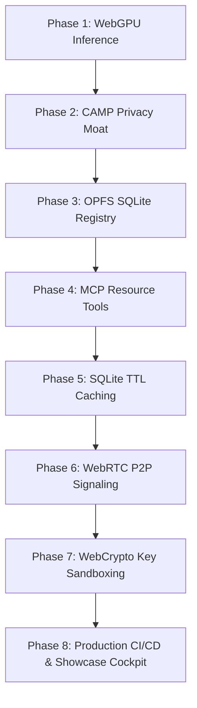

# Sentinel Intelligence Layer

[](https://doi.org/10.5281/zenodo.20529516)

The Sentinel Intelligence Layer is a privacy-first, browser-local agentic prototype designed to evaluate sensitive assistance workflows such as medical, housing, food, and financial resource routing.

By combining browser-side WebGPU inference, deterministic client-side privacy filtering, SQLite-backed local persistence, and signed encrypted WebRTC signaling, it studies how much sensitive prompt exposure can be reduced before model inference and tool routing. Optional integrations such as weather APIs, geocoding, telemetry, and signaling relays can still introduce external metadata exposure, so this repository frames the system as browser-local by default rather than as a complete anonymity or zero-cloud guarantee.

---

## Research Positioning

This repository is being prepared as an applied systems and privacy-engineering research artifact. The current paper framing is:

> Evaluating Browser-Local Privacy Filtering for Sensitive AI Assistance Workflows

The central claim is intentionally narrow: deterministic pre-tokenization pruning can reduce sensitive prompt exposure in constrained browser-local assistance workflows, but it is not a formal anonymity system, zero-knowledge protocol, or differential privacy mechanism.

Research materials:
*   **Research Paper (Preprint)**: [Zenodo DOI: 10.5281/zenodo.20529516](https://doi.org/10.5281/zenodo.20529516)
*   **Scope**: `docs/research-scope.md`
*   **Threat Model**: `docs/threat-model.md`
*   **Paper Draft Scaffold**: `paper/`
*   **Evaluation Output**: `evaluation-results/camp-summary.md`

---

## Technical Components

### 1. Browser-Local Inference
Powered by `@mlc-ai/web-llm` running Llama-3.2-1B and SmolLM2-135M parameter models, language-model reasoning can run natively inside the browser. By leveraging local GPU unified memory via WebGPU, the framework reduces dependency on server-side inference for supported devices and workflows.

### 2. Autonomous Privacy Engineering (CAMP)
The Cumulative Agentic Masking and Pruning (CAMP) middleware calculates a Cumulative PII Exposure (CPE) score in real-time. It separates sensitive data into two classes: **Direct Identifiers** (such as emails, credentials, financial details, government IDs, phone numbers, addresses, and recovery secrets) which are pruned immediately, and **Quasi-Identifiers** (such as names, general locations, age, professions, and medical terms) which are evaluated statefully and pruned only when their combined CPE score crosses the re-identifiability threshold ($\tau = 1.0$). CAMP strips sensitive values before model tokenization, preserves markdown code blocks for developer workflows, and persists only hashed fragment fingerprints in the browser's Origin Private File System (OPFS) via SQLite.

### CAMP Recruiter Demo
Input:
```text
My name is Pranav, my email is pranav@example.com, my password is SuperSecret123, and my vault clue is blue-lamp-77.
```

Sanitized payload:
```text
My name is [NAME_PRUNED], my email is [EMAIL_PRUNED], my password is [CREDENTIAL_PRUNED], and my vault clue is [SENSITIVE_FIELD_PRUNED].
```

Why it matters: the app is not simply hiding a few hardcoded fields. It demonstrates a privacy runtime that can classify and prune both known PII and newly disclosed sensitive data before the local agent or retrieval layer consumes the prompt.

### 3. Cryptographic Key Isolation (IndexedDB WebCrypto Sandbox)
To eliminate Cross-Site Scripting (XSS) and dependency injection exfiltration risks associated with browser storage (such as `localStorage`), the system generates Ed25519 agent keys using the WebCrypto API with `{ extractable: false }`. The key structures are committed as binary objects inside an isolated browser IndexedDB sandbox, preventing raw JavaScript access or key exports.

### 4. Signed Encrypted P2P WebRTC Signaling
Direct browser-to-browser WebRTC database queries resolve resources dynamically via peer-to-peer tunnels. To protect the signaling phase from hijacking over untrusted WebSocket servers, all SDP offers and answers are cryptographically signed with the agent's private key. Peer keys are verified against public fingerprints, and payloads are timestamp-bound to prevent replay attacks.

### 5. Multi-Threaded Engine Offloading
Heavy shader compilation and token generation routines are offloaded to background Web Worker threads. By isolating MLC engine processes from the main browser thread, the application keeps UI rendering at a steady 60 FPS during text generation.

### 6. Resilience-Privacy Index (I_rp)
The framework tracks a real-time Resilience-Privacy Index as an exploratory engineering metric:

$$I_{rp} = \text{Edge Speed (tokens/sec)} \times (1 + \text{Privacy Efficacy})$$

Where:
*   $\text{Privacy Efficacy} = 1.0$ (Processed fully locally and sanitized)
*   $\text{Privacy Efficacy} = 0.0$ (Processed via standard cloud API where data leaves the client device)

---

## System Architecture and Stack

*   **Application Framework**: Next.js 16 (Webpack context), React 19, TypeScript.
*   **Inference Engine**: WebGPU shader compilation via `@mlc-ai/web-llm` and WASM.
*   **Process Isolation**: Web Workers (LLM Engine thread, CAMP sanitization thread).
*   **Local Storage**: WebAssembly SQLite (`wa-sqlite`) in the browser's Origin Private File System (OPFS) and IndexedDB for cryptographic key storage.
*   **P2P Transport**: WebRTC DataChannels (`RTCPeerConnection`) with WebSocket signaling.
*   **Cryptography**: Ed25519 signing and verification via native `window.crypto.subtle` API.

---

## Reproducible Evaluation

CAMP is evaluated with a deterministic 100-case benchmark covering mixed PII, contact data, addresses, medical disclosures, financial identifiers, government identifiers, arbitrary secret disclosures, benign prompts, developer code snippets, and quasi-identifiers.

Run the benchmark:
```bash
npm run eval:camp
```

Current generated headline result:

| Variant | Cases | Precision | Recall | F1 |
| --- | ---: | ---: | ---: | ---: |
| CAMP clean synthetic | 100 | 100.0% | 100.0% | 100.0% |
| Simple regex baseline clean synthetic | 100 | 88.5% | 45.4% | 60.0% |
| CAMP adversarial/noisy | 100 | 100.0% | 100.0% | 100.0% |
| Simple regex baseline adversarial/noisy | 100 | 95.2% | 19.3% | 32.1% |

These numbers are a feasibility measurement, not a universal guarantee. CAMP performs well on the clean deterministic suite and the current adversarial/noisy suite, but both suites remain synthetic and detector-aware. The next strongest external-validity step is testing prompts collected or written independently from the detector implementation.

---

## Development Phases

The codebase has transitioned from a local research prototype to a production-hardened system across eight development phases:



### Phase 1: Local Edge Inference Context
Integrated WebLLM to load model weights directly on the client's GPU, establishing local inference.

### Phase 2: Cumulative Agentic Masking & Pruning (CAMP)
Engineered the CAMP pipeline with priority-based entity detection, arbitrary sensitive-field pruning, hashed local fragment tracking, and code-block preservation prior to model tokenization.

### Phase 3: Browser-Side OPFS SQLite Integration
Configured WebAssembly-powered SQLite to serve as the local storage engine in the browser's high-speed Origin Private File System.

### Phase 4: Model Context Protocol (MCP) Standard
Formatted tool capabilities (Resource Searches and Availability lookups) under standardized MCP schemas to enable modular routing.

### Phase 5: SQLite TTL Caching & Input Sanitization
Implemented cache-aside logic with SQLite persistence for Overpass queries to protect external APIs from rate limits, and added input sanitization to prevent QL injection.

### Phase 6: P2P Manual Signaling Protocol
Created a direct console to enable manual copy-paste peer connection setup for debugging without signaling servers.

### Phase 7: Cryptographic Key Sandboxing (IndexedDB)
Replaced local storage key arrays with non-extractable Ed25519 WebCrypto keys stored in IndexedDB, and added digital signatures to all WebRTC handshake packets.

### Phase 8: Production CI/CD, Fallbacks & Showcase Cockpit
*   **WASM & WebGPU Fallbacks**: Implemented an interactive Demonstration Mode that automatically runs if WebGPU is missing. This mode runs the real CAMP firewall and pulls live geocoded Open-Meteo weather details using browser fetches.
*   **Showcase Cockpit (/simulator)**: Built an interactive sandbox detailing SVG network connection steps, active packet transfer animations, and architectural code blueprints.
*   **CI/CD Automation**: Integrated validation for code compilation, ESLint compliance, and Vitest execution.

---

## Getting Started and Commands

### Prerequisites
*   Node.js v20+
*   A WebGPU-compatible modern browser (Chrome/Edge 113+, Safari 18+)

### Installation
1.  Clone the repository:
    ```bash
    git clone https://github.com/PranavSinghRawat/Sentinel-Intelligence.git
    ```
2.  Install dependencies:
    ```bash
    npm install
    ```
3.  Run in Development Mode:
    ```bash
    npm run dev
    ```

### Verification and Testing
To execute linting, type-checking, and the full test suite locally:
```bash
# Run unit and integration tests (Vitest)
npm run test

# Run ESLint compliance checks
npm run lint

# Validate TypeScript type-safety
npx tsc --noEmit

# Run the reproducible CAMP benchmark
npm run eval:camp
```
