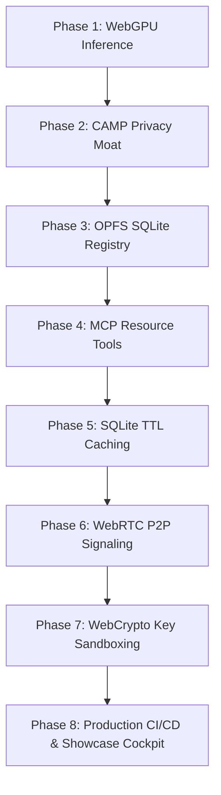

# Sovereign Intelligence Layer

The Sovereign Intelligence Layer is a privacy-first, edge-native agentic framework designed to provide secure access to sensitive aid directories (such as medical, housing, and food resources) without transmitting personally identifying information (PII) to cloud networks.

By combining browser-side WebGPU inference, autonomous client-side guardrails, SQLite-backed caching, and end-to-end encrypted WebRTC peer-to-peer (P2P) networking, it establishes a zero-cloud application infrastructure model where data privacy is enforced at the compilation and network layer.

---

## Technical Innovations and Security Moats

### 1. Edge Sovereignty (Zero-Cloud Inference)
Powered by `@mlc-ai/web-llm` running Llama-3.2-1B and SmolLM2-135M parameter models, all language model reasoning occurs natively inside the browser. By leveraging local GPU unified memory via WebGPU, the framework achieves zero server hosting costs, complete offline availability, and immunity to server-side data breaches.

### 2. Autonomous Privacy Engineering (CAMP)
The Cumulative Agentic Masking and Pruning (CAMP) middleware calculates a Cumulative PII Exposure (CPE) score in real-time. It combines specific detectors for high-risk entities (names, emails, credentials, financial identifiers, government IDs, phone numbers, addresses, medical terms) with a generic disclosure detector that can prune arbitrary user-provided fields such as "my vault clue is ..." or "our internal project code is ..." without predefining every field name. CAMP strips sensitive values before model tokenization, preserves markdown code blocks for developer workflows, and persists only hashed fragment fingerprints in the browser's Origin Private File System (OPFS) via SQLite.

### CAMP Recruiter Demo
Input:
```text
My name is Pranav, my email is pranav@example.com, my password is SuperSecret123, and my vault clue is blue-lamp-77.
```

Sanitized payload:
```text
My name is [NAME_PRUNED], my email is [EMAIL_PRUNED], my password is [CREDENTIAL_PRUNED], and my vault clue is [SENSITIVE_FIELD_PRUNED].
```

Why it matters: the app is not simply hiding a few hardcoded fields. It demonstrates a privacy runtime that can classify and prune both known PII and newly disclosed sensitive data before the local agent or retrieval layer consumes the prompt.

### 3. Cryptographic Key Isolation (IndexedDB WebCrypto Sandbox)
To eliminate Cross-Site Scripting (XSS) and dependency injection exfiltration risks associated with browser storage (such as `localStorage`), the system generates Ed25519 agent keys using the WebCrypto API with `{ extractable: false }`. The key structures are committed as binary objects inside an isolated browser IndexedDB sandbox, preventing raw JavaScript access or key exports.

### 4. MitM-Resilient P2P WebRTC Signaling
Direct browser-to-browser WebRTC database queries resolve resources dynamically via peer-to-peer tunnels. To protect the signaling phase from hijacking over untrusted WebSocket servers, all SDP offers and answers are cryptographically signed with the agent's private key. Peer keys are verified against public fingerprints, and payloads are timestamp-bound to prevent replay attacks.

### 5. Multi-Threaded Engine Offloading
Heavy shader compilation and token generation routines are offloaded to background Web Worker threads. By isolating MLC engine processes from the main browser thread, the application keeps UI rendering at a steady 60 FPS during text generation.

### 6. Mathematical Resilience Index (I_rp)
The framework defines a real-time Resilience-Privacy Index to validate edge performance metrics:

$$I_{rp} = \text{Edge Speed (tokens/sec)} \times (1 + \text{Privacy Efficacy})$$

Where:
*   $\text{Privacy Efficacy} = 1.0$ (Processed fully locally and sanitized)
*   $\text{Privacy Efficacy} = 0.0$ (Processed via standard cloud API where data leaves the client device)

---

## System Architecture and Stack

*   **Application Framework**: Next.js 16 (Webpack context), React 19, TypeScript.
*   **Inference Engine**: WebGPU shader compilation via `@mlc-ai/web-llm` and WASM.
*   **Process Isolation**: Web Workers (LLM Engine thread, CAMP sanitization thread).
*   **Local Storage**: WebAssembly SQLite (`wa-sqlite`) in the browser's Origin Private File System (OPFS) and IndexedDB for cryptographic key storage.
*   **P2P Transport**: WebRTC DataChannels (`RTCPeerConnection`) with WebSocket signaling.
*   **Cryptography**: Ed25519 signing and verification via native `window.crypto.subtle` API.

---

## Development Phases

The codebase has transitioned from a local research prototype to a production-hardened system across eight development phases:



### Phase 1: Local Edge Inference Context
Integrated WebLLM to load model weights directly on the client's GPU, establishing local inference.

### Phase 2: Cumulative Agentic Masking & Pruning (CAMP)
Engineered the CAMP pipeline with priority-based entity detection, arbitrary sensitive-field pruning, hashed local fragment tracking, and code-block preservation prior to model tokenization.

### Phase 3: Browser-Side OPFS SQLite Integration
Configured WebAssembly-powered SQLite to serve as the local storage engine in the browser's high-speed Origin Private File System.

### Phase 4: Model Context Protocol (MCP) Standard
Formatted tool capabilities (Resource Searches and Availability lookups) under standardized MCP schemas to enable modular routing.

### Phase 5: SQLite TTL Caching & Input Sanitization
Implemented cache-aside logic with SQLite persistence for Overpass queries to protect external APIs from rate limits, and added input sanitization to prevent QL injection.

### Phase 6: P2P Manual Signaling Protocol
Created a direct console to enable manual copy-paste peer connection setup for debugging without signaling servers.

### Phase 7: Cryptographic Key Sandboxing (IndexedDB)
Replaced local storage key arrays with non-extractable Ed25519 WebCrypto keys stored in IndexedDB, and added digital signatures to all WebRTC handshake packets.

### Phase 8: Production CI/CD, Fallbacks & Showcase Cockpit
*   **WASM & WebGPU Fallbacks**: Implemented an interactive Demonstration Mode that automatically runs if WebGPU is missing. This mode runs the real CAMP firewall and pulls live geocoded Open-Meteo weather details using browser fetches.
*   **Showcase Cockpit (/simulator)**: Built an interactive sandbox detailing SVG network connection steps, active packet transfer animations, and architectural code blueprints.
*   **CI/CD Automation**: Integrated a GitHub Actions workflow validating code compilation, ESLint compliance, and Vitest execution (all 28 unit tests passing).

---

## Getting Started and Commands

### Prerequisites
*   Node.js v20+
*   A WebGPU-compatible modern browser (Chrome/Edge 113+, Safari 18+)

### Installation
1.  Clone the repository:
    ```bash
    git clone https://github.com/PranavSinghRawat/Sovereign-Intelligence.git
    ```
2.  Install dependencies:
    ```bash
    npm install
    ```
3.  Run in Development Mode:
    ```bash
    npm run dev
    ```

### Verification and Testing
To execute linting, type-checking, and the full test suite locally:
```bash
# Run unit and integration tests (Vitest)
npm run test

# Run ESLint compliance checks
npm run lint

# Validate TypeScript type-safety
npx tsc --noEmit
```
