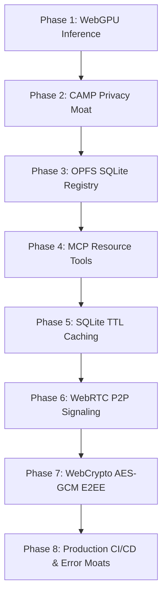

# Sovereign Intelligence Layer

The **Sovereign Intelligence Layer** is a privacy-first, local-only agentic framework designed to provide community members with secure access to sensitive aid resources (e.g., medical, housing, food) without ever exposing PII to external cloud networks.

By combining browser-side WebGPU inference, autonomous local-first guardrails, SQLite-backed resilient caching, and application-layer end-to-end encrypted WebRTC P2P networking, it establishes a zero-cloud infrastructure model where **Privacy is an Absolute Feature**.

---

## 🚀 Key Innovations & Moats

### 1. Edge Sovereignty (Zero-Cloud Inference)
Powered by `@mlc-ai/web-llm` running the highly optimized `SmolLM2-135M` / `Llama-3.2-1B` models, all LLM reasoning occurs natively inside the browser. It scales infinitely at zero server cost, works offline, and is immune to server-side breaches.

### 2. Autonomous Privacy Engineering (CAMP)
The **Cumulative Agentic Masking and Pruning (CAMP)** middleware calculates a **Cumulative PII Exposure (CPE)** score in real-time. If the prompt contains a combination of high-risk identifiers (e.g., Name + Location + Medical Need), CAMP automatically intercepts and prunes the prompt before the local LLM processes it. It persists all redacted fragments in a local SQLite database in the browser's Origin Private File System (OPFS).

### 3. SQLite TTL API Caching & Input Sanitization
In order to prevent external API rate-limiting (e.g., Overpass API) and safeguard against QL injection attacks, the system utilizes a persistent **SQLite TTL caching layer**. API responses are cached locally for 1 hour, and all query inputs are strictly sanitized prior to execution.

### 4. End-to-End (E2EE) WebRTC Peer-to-Peer Protocol
Peer-to-peer data channels (`agent://` protocol) enable secure peer links directly. Utilizing the native **Web Crypto API**, payloads sent over the WebRTC DataChannel are fully encrypted with symmetric **AES-256-GCM** keys derived from the SDP offer, protecting communications even if the network transport layer is compromised.

### 5. Mathematical Proof of Trust ($I_{rp}$)
We define the **Resilience-Privacy Index ($I_{rp}$)** as a real-time scientific validator of private edge performance:
$$I_{rp} = \text{Edge Speed (tokens/sec)} \times (1 + \text{Privacy Efficacy})$$
Where:
- $\text{Privacy Efficacy} = 1.0$ (Fully Local & Pruned)
- $\text{Privacy Efficacy} = 0.0$ (Cloud API processing where data leaks off-device)

The UI dashboard renders a live scientific benchmark table comparing Local edge performance to standard Cloud API baselines.

---

## 🏗️ System Architecture & Stack

- **Framework**: Next.js 15+ (App Router), React, TypeScript.
- **Inference Engine**: WebGPU context via `@mlc-ai/web-llm` using WASM.
- **Database Engine**: Persistent `wa-sqlite` (WebAssembly SQLite) operating in the **Origin Private File System (OPFS)**.
- **Networking**: WebRTC Direct P2P DataChannels using `RTCPeerConnection`.
- **Cryptography**: AES-GCM-256 via the Native browser `window.crypto.subtle` API.
- **Safety / telemetry**: `TelemetryLogger` with strict local anonymization moats (masking local file paths, IP geolocations, and respecting absolute opt-in/opt-out configuration).

---

## 🛠️ The 8 Phases of Enterprise Hardening

The repository has transitioned from a local research prototype into a robust production-grade repository across eight rigorous development phases:



### Phase 1: Local Edge Inference Context
Integrated `@mlc-ai/web-llm` and loaded models directly on the client's GPU, establishing true local autonomy.

### Phase 2: Cumulative Agentic Masking & Pruning (CAMP)
Engineered the CAMP pipeline, establishing deterministic security pre-processors to block self-referential medical queries and classify/prune PII.

### Phase 3: Browser-Side OPFS SQLite Integration
Configured WebAssembly-powered SQLite (`wa-sqlite`) to serve as the persistent storage engine in the browser's high-speed Origin Private File System.

### Phase 4: Model Context Protocol (MCP) Standard
Formatted tool capabilities (Resource Searches and Availability lookups) under standardized MCP schemas to enable seamless modular scaling.

### Phase 5: SQLite TTL Caching & Input Sanitization
Implemented cache-aside logic with SQLite persistence for third-party REST queries to protect external APIs from rate limits, and added rigorous injection sanitization.

### Phase 6: P2P Manual Signaling Protocol
Created the WebRTC direct console in the user interface to enable copy-paste peer link setup without intermediate backend signaling servers.

### Phase 7: Application-Layer WebCrypto E2EE
Added symmetric key derivation using Web Crypto's PBKDF2 algorithm over the SDP exchange, securing all browser-to-browser transactions.

### Phase 8: CI/CD Quality Automation & Crash Resilience
Wrapped the React application inside a specialized WebGPU/WASM `ErrorBoundary` to gracefully handle GPU initialization crashes, implemented standard telemetry opt-in states, and integrated a complete **GitHub Actions workflow** for automated testing, linting, and build validation.

---

## 📦 Getting Started & Commands

### Prerequisites
- Node.js v18+
- A WebGPU-compatible modern browser (e.g. Chrome/Edge 113+, Safari 18+).

### Installation
1. Clone the repository:
   ```bash
   git clone https://github.com/PranavSinghRawat/Sovereign-Intelligence.git
   ```
2. Install dependencies:
   ```bash
   npm install
   ```
3. Run in Development Mode:
   ```bash
   npm run dev
   ```

### Verification & Testing
To execute linting, type-checking, and the full test suite locally:
```bash
# Run unit & integration tests
npm run test

# Run ESLint validation
npm run lint

# Validate TypeScript type-safety
npx tsc --noEmit
```

---
*Built to define a new paradigm of private, resilient, and enterprise-grade decentralized software.*
