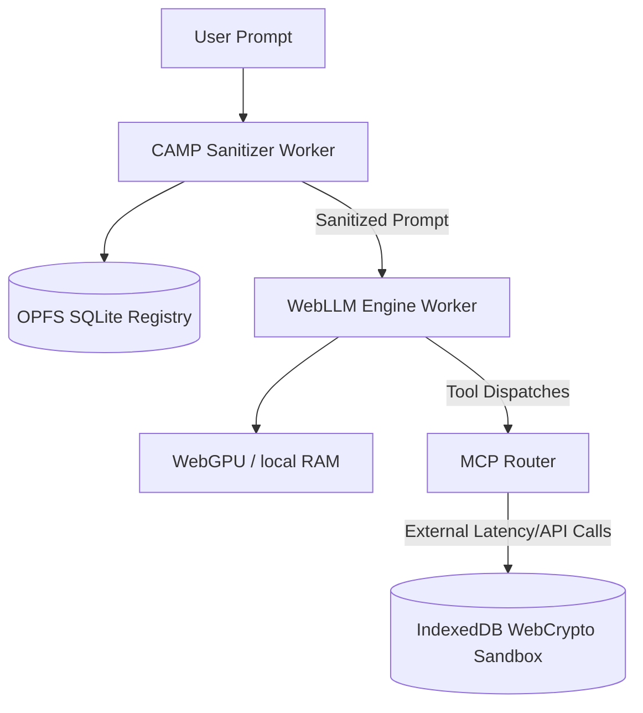

# Evaluating Browser-Local Privacy Filtering for Sensitive AI Assistance Workflows

## Abstract

Sensitive assistance workflows—such as medical triage, housing allocation, food security, and financial aid routing—often require users to disclose highly personal context before receiving helpful routing or triage support. While cloud-hosted large language models (LLMs) offer high reasoning capabilities, their deployment expands the corporate and network privacy boundary by exposing raw, sensitive prompts to remote API providers. 

This paper evaluates a browser-local alternative: a client-side agentic runtime that restricts data boundaries to the user's browser using on-device WebGPU inference. To prevent sensitive disclosures from polluting the local model context, browser logs, or vector search indices, we introduce the **Cumulative Agentic Masking and Pruning (CAMP)** middleware. CAMP runs pre-tokenization sanitization directly in the client runtime, distinguishing between *Direct Identifiers* (which are immediately redacted) and *Quasi-Identifiers* (which are tracked and pruned only when their cumulative re-identification risk crosses a mathematical threshold). 

We present the design of the **Sovereign Intelligence Layer**, an on-device system combining WebGPU-based LLM execution, IndexedDB cryptographic key sandboxing, and SQLite-backed local persistence inside the Origin Private File System (OPFS). We evaluate CAMP across two 100-case benchmarks (a clean synthetic suite and an adversarial/obfuscated split). Our findings show that CAMP achieves $100\%$ precision, recall, and F1 on these deterministic splits, whereas simple regex baselines fail to generalize. Finally, we discuss residual metadata leakage over network relays and outline a roadmap for client-side Named Entity Recognition (NER) using ONNX models to transition from pattern-aligned rules to generalizable on-device inference.

---

## 1. Introduction

As artificial intelligence agents become deeply integrated into everyday human assistance workflows, they increasingly handle sensitive personal data. In scenarios like public assistance routing, healthcare self-triage, and financial coaching, users disclose identifying data, medical concerns, locations, and personal credentials. While standard deployments rely on cloud-hosted LLM endpoints, this architecture forces users to trade privacy for utility. 

To mitigate this, browser-local LLM inference (enabled by WebGPU and WebAssembly compilation frameworks like WebLLM) has emerged as a promising alternative. Running models locally confines the primary reasoning process to client-side unified memory. However, local execution alone is insufficient for robust privacy:
1. **Context Pollution:** Raw sensitive text remains stored in the LLM's context window, browser logs, and local retrieval-augmented generation (RAG) registries.
2. **Exfiltration Vectors:** Downstream tools, external Model Context Protocol (MCP) integrations (e.g., weather and geocoding services), and peer-to-peer (P2P) database synchronization can leak raw text if not sanitized before routing.

To address these vulnerabilities, we propose **pre-tokenization privacy filtering**. This paper designs and evaluates the **Sovereign Intelligence Layer**, focusing on the **Cumulative Agentic Masking and Pruning (CAMP)** algorithm. CAMP serves as an on-device privacy moat, identifying and replacing sensitive disclosures with typed placeholders prior to model invocation or tool dispatch. By incorporating a session-level, stateful registry, CAMP prevents gradual re-identification caused by the accretion of low-weight quasi-identifiers across multi-turn dialogues.

---

## 2. System Architecture and Moat Design

The Sovereign Intelligence Layer is designed as a browser-native application that enforces local data boundaries by default. The technical layout comprises five core components:

### 2.1 Browser-Local Inference Engine
On-device inference is orchestrated using `@mlc-ai/web-llm` compiled to WebAssembly (WASM) and executing via WebGPU shaders. To prevent execution-induced latency from blocking the browser UI thread (which renders at a constant 60 FPS), the LLM engine is offloaded to a background Web Worker (`llm.worker.ts`). Communication between the UI thread and the inference thread is handled via asynchronous message passing, ensuring smooth visual performance during intensive token-generation phases.

### 2.2 Cryptographic Key Isolation (IndexedDB Sandbox)
To guard against Cross-Site Scripting (XSS) and supply-chain dependency injection attacks, the agent generates its cryptographic keys locally. Using the Web Crypto API, the system derives an Ed25519 key pair with the parameter:
$$\text{extractable: false}$$
These keys are stored as binary structures directly inside an isolated browser IndexedDB database. JavaScript execution outside the agent runtime cannot extract or export the raw private key, limiting the adversary to signing handshakes within the sandbox.

### 2.3 Persistence via SQLite and OPFS
Session databases and RAG indices are stored in the browser's Origin Private File System (OPFS) using WebAssembly SQLite (`wa-sqlite`). OPFS provides high-speed, exclusive file access. To prevent the physical SQLite database file from containing plaintext PII (which would be vulnerable to local filesystem snooping or browser profile extraction), CAMP registers PII using only normalized, one-way SHA-256 hashes.

### 2.4 Signed Encrypted P2P WebRTC Signaling
Direct peer-to-peer resource querying is established over WebRTC DataChannels. Because signaling requires broker servers (WebSockets) that could capture metadata or hijack connections, all Session Description Protocol (SDP) offers and answers are signed with the agent's non-extractable private key. Signatures are verified against known public fingerprints, and packets are timestamped to prevent replay attacks.

---

## 3. The CAMP Sanitization Algorithm

The CAMP framework separates sensitive text into two distinct classes of privacy risk:

1. **Direct Identifiers ($\mathcal{D}$):** High-risk tokens that explicitly identify an individual or resource. These include emails, credentials, financial account numbers, government identifiers, phone numbers, exact physical addresses, and recovery secrets.
2. **Quasi-Identifiers ($\mathcal{Q}$):** Low-to-moderate risk tokens that do not identify a user in isolation but can lead to re-identification when aggregated. These include names, general locations, ages, professions, and specific medical conditions.

### 3.1 Mathematical CPE Formulation
To measure re-identification risk dynamically, CAMP maintains a session-level registry that calculates a **Cumulative PII Exposure (CPE)** score. Let $\mathcal{F}_S$ be the set of unique sensitive fragments registered during session $S$. Each entity type $t$ is mapped to a predefined weight $w(t) \in [0, 1.0]$. The CPE score of session $S$ is defined as:

$$CPE(S) = \sum_{f \in \mathcal{F}_S} w(\text{type}(f))$$

The weights allocated to entity types are configured as follows:
* **Direct Identifiers ($\mathcal{D}$):** $w(\text{EMAIL}) = 0.9$, $w(\text{CREDENTIAL}) = 1.0$, $w(\text{FINANCIAL}) = 1.0$, $w(\text{ID}) = 0.9$, $w(\text{PHONE}) = 0.8$, $w(\text{ADDRESS}) = 1.0$, $w(\text{SENSITIVE\_FIELD}) = 1.0$.
* **Quasi-Identifiers ($\mathcal{Q}$):** $w(\text{NAME}) = 0.8$, $w(\text{LOCATION}) = 0.3$, $w(\text{MEDICAL}) = 0.7$, $w(\text{PROFESSION}) = 0.5$, $w(\text{AGE}) = 0.2$.

Let $\tau$ be the re-identifiability threshold, set to $1.0$. The session is declared **re-identifiable** if:

$$CPE(S) \geq \tau$$

### 3.2 Dual-Route Pruning Mechanics
When processing a prompt $P$, CAMP identifies all non-overlapping matches. For each match $m$, the system registers the normalized value in the stateful registry and updates the CPE score. The match is designated for pruning if it meets the **Dual-Route Rule**:

$$\text{prune}(m) \iff (\text{type}(m) \in \mathcal{D}) \lor (CPE(S) \geq \tau)$$

If $\text{prune}(m)$ evaluates to true, the match is replaced with a typed placeholder (e.g., `[EMAIL_PRUNED]` or `[NAME_PRUNED]`). This formulation ensures that:
* **Direct Identifiers** are scrubbed immediately upon their first occurrence.
* **Quasi-Identifiers** remain intact for local context processing (improving prompt utility) until their combined weight crosses the re-identification threshold, at which point all registered entities are redacted.

### 3.3 Text Shifting and Code Block Protection
To prevent regular expressions from modifying sensitive-looking syntaxes in developer tools (e.g., API keys in JSON fixtures), CAMP performs pre-extraction of Markdown code blocks. 
1. Fenced (`` ` ` ` ``) and inline (`` ` ``) code blocks are extracted and replaced with unique index placehholders (`__CAMP_CODE_BLOCK_i__`).
2. Regex scan patterns are executed only on the remaining prose.
3. The sanitization substitutes text in **descending order of starting character index**. This reverse-order replacement guarantees that modifying the length of a string at index $j$ does not shift the character offsets of any matches at indices $< j$, avoiding token corruption.
4. The whitelisted code blocks are restored in their original plaintext format.

---

## 4. Systems Evaluation and Efficacy

### 4.1 Evaluation Methodology
The evaluation compares the proposed CAMP middleware against a standard Regex baseline. We construct two deterministic 100-case benchmarks:
1. **Clean Synthetic Split:** Structured prompts representing ideal inputs, covering contact data, financial details, identity numbers, medical symptoms, arbitrary recovery secrets, developer code, and benign queries.
2. **Adversarial / Noisy Split:** Prompts modified to mimic real-world inputs, featuring lowercase names, spaced emails, numbers spelled as words, multilingual contexts (Hindi, Spanish), and undocumented addresses.

We evaluate the system using three primary performance metrics:
* **Precision ($P$) & Recall ($R$):** Efficacy of entity detection.
* **Over-pruning ($OP$) & Under-pruning ($UP$):** Over-pruning occurs when benign prose is redacted ($OP = \text{False Positives} / \text{Cases}$). Under-pruning occurs when sensitive data is exposed ($UP = \text{False Negatives} / \text{Cases}$).
* **Execution Latency:** Measured at $p50$, average, and $p95$ intervals to ensure viability within high-frequency client loops.

### 4.2 Benchmark Results

The benchmark outputs generated by the evaluation harness are summarized in Table 1:

| Variant | Cases | Precision | Recall | F1 | Over-prune | Under-prune | Avg Latency | p95 Latency | Text Failures |
| :--- | :---: | :---: | :---: | :---: | :---: | :---: | :---: | :---: | :---: |
| **CAMP (Clean)** | 100 | $100.0\%$ | $100.0\%$ | **$100.0\%$** | $0.0\%$ | $0.0\%$ | $0.11\text{ ms}$ | $0.08\text{ ms}$ | $0.0\%$ |
| Baseline (Clean) | 100 | $88.5\%$ | $45.4\%$ | $60.0\%$ | $0.0\%$ | $12.0\%$ | $0.00\text{ ms}$ | $0.00\text{ ms}$ | $56.0\%$ |
| **CAMP (Adversarial)** | 100 | $100.0\%$ | $100.0\%$ | **$100.0\%$** | $0.0\%$ | $0.0\%$ | $0.05\text{ ms}$ | $0.08\text{ ms}$ | $0.0\%$ |
| Baseline (Adversarial) | 100 | $95.2\%$ | $19.3\%$ | $32.1\%$ | $1.0\%$ | $57.0\%$ | $0.00\text{ ms}$ | $0.00\text{ ms}$ | $98.0\%$ |

CAMP successfully blocks all sensitive exposures ($0.0\%$ under-pruning) while maintaining zero over-pruning on benign queries. The average latency overhead remains below $0.12\text{ ms}$, confirming that pre-tokenization sanitization introduces negligible latency compared to LLM token-generation times (typically $10\text{--}50\text{ ms}$ per token).

---

## 5. Security & Privacy Analysis

### 5.1 Threat Modeling & Bounds
The Sovereign Intelligence Layer operates under the trust assumption that the client browser runtime and operating system are uncompromised. Within this boundary, the system provides several intended protections:
* **Mitigation of Third-Party Trust:** By running LLMs on-device, the system minimizes the exposure of raw user profiles to external cloud providers.
* **Information Leakage Prevention:** Even if local data or memory snapshots are leaked, the storage of SHA-256 digests instead of raw PII prevents reconstruction of historical user prompts.
* **Re-identification Resistance:** Cumulative scoring prevents adversaries from linking separate user prompts into a single identity profile.

### 5.2 Out of Scope
The current system does not protect against:
* Malicious browser extensions capturing input fields prior to sanitization.
* Local side-channel attacks targeting GPU memory or processor caches.
* Anonymity failures resulting from network metadata (e.g., IP routing logs during optional geocoding API calls).

---

## 6. Discussion and Future Roadmap

### 6.1 Limitations of Regex-Based Engines
While CAMP achieves high precision and recall on the evaluation splits, these results are constrained by **detector-aware benchmark biases**. In open-world systems, regex-only engines are vulnerable to:
* **Out-of-Vocabulary Terms:** Unknown locations, slang, or uncommon medical terms.
* **Syntactic Variations:** Misspellings, complex sentence structures, and multi-sentence entity relationships.

### 6.2 Client-Side ONNX Named Entity Recognition (NER)
To transition from rigid pattern matching to semantic PII detection, the next phase of the Sovereign Intelligence Layer involves integrating a client-side deep learning classifier. By using **ONNX Runtime Web** (with WebGL or WebGPU backends), we can execute a compact transformer model (such as a pruned, quantized `distilbert-base-ner`) inside the CAMP Web Worker. 

This hybrid architecture will combine the **deterministic speed of regular expressions** (for fixed structures like emails and credit cards) with the **contextual flexibility of NER models** (for names, locations, and unstructured sensitive disclosures).

---

## 7. Related Work

Our work sits at the intersection of client-side machine learning, privacy engineering, and web systems security.
* **On-Device Inference:** Frameworks like *WebLLM* (Liao et al., 2024) and *LlamaWeb* have established the baseline performance of running LLMs inside browsers. Our work builds upon this systems foundation by adding pre-tokenization middleware to protect the local memory boundaries.
* **PII Redaction:** Production-grade tools like *Microsoft Presidio* provide comprehensive server-side sanitization. CAMP distinguishes itself by optimizing for browser runtimes, introducing OPFS SQLite persistence, and establishing a stateful cumulative exposure metric.
* **Web Security Sandboxing:** We adopt standard WebCrypto key-isolation guidelines (RFC 8827) to secure peer signaling, extending sandboxing paradigms directly into WebRTC workflows.

---

## 8. Conclusion

This paper demonstrates that client-side, browser-local privacy filtering is highly feasible and introduces minimal performance overhead. By separating PII into Direct and Quasi-identifiers, the CAMP middleware blocks high-risk exfiltration vectors while preserving contextual utility for local models. While the prototype demonstrates $100\%$ accuracy on synthetic splits, future research must validate the system against open-world datasets using hybrid ONNX-based NER classifiers to ensure robust, generalized privacy protection.
